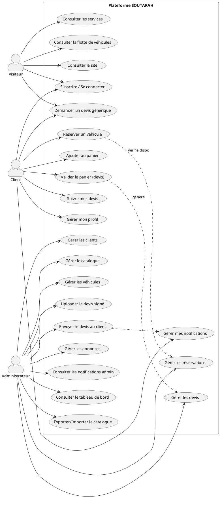
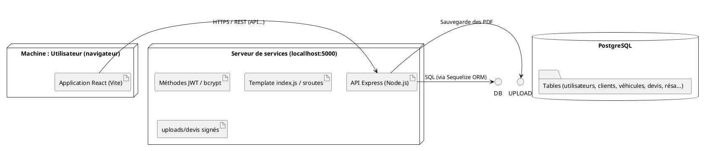

# 📐 CODES PLANTUML DES DIAGRAMMES UML

Ce fichier contient les codes PlantUML à copier/coller sur le site https://www.plantuml.com/plantuml/uml pour générer vos diagrammes.

---

## 1. DIAGRAMME DE CAS D'UTILISATION

**Fichier :** `usecase.puml`



---

## 2. DIAGRAMME DE SÉQUENCE — RÉSERVATION D'UN VÉHICULE

**Fichier : `sequence-reservation.puml`**

```plantuml
@startuml
actor "Client" as Client
participant "Page Services" as Page
participant "Modal Réservation" as Modal
participant "Panier (localStorage)" as Panier
participant "API /vehicles/availability" as API1
boundary "API /cart/notify-vehicle" as API2
database "PostgreSQL (Réservations)" as DB

Client -> Page : Clique sur "Réserver ce véhicule"
Page -> Modal : Ouvre le modal (dates, destination, chauffeur)
Client -> Modal : Renseigne dates et clique "Ajouter au panier"

Modal -> API1 : GET /vehicles/{id}/availability?startAt&endAt
API1 -> BDD : Vérifier conflits (PENDING, CONFIRMED)
DB --> API1 : Réponse (available: true/false)
API1 --> Modal : JSON { available }

alt Véhicule indisponible
    Modal --> Client : Affiche message "Véhicule déjà réservé..."
else Véhicule disponible
    Modal -> API2 : POST /cart/notify-vehicle (vérification serveur)
    API2 -> BDD : Vérifier conflits
    API2 --> Modal : 201 ok / 409 erreur

    if 409 alors
        Modal --> Client : Message d'erreur (page ne change pas)
    else
        Modal -> Panier : Enregistre la location (localStorage)
        Panier --> Modal : Notification cart-updated
        Modal --> Client : Redirection vers le panier
    endif
    Modal --> Client : Redirection vers le panier
    Panier --> Client : Affiche la location
end

@enduml
```

---

## 3. DIAGRAMME DE SÉQUENCE — GESTION D'UN DEVIS (ADMIN)

**Fichier : `sequence-devis-admin.puml`**

```plantuml
@startuml
sequence "Administrateur" as Admin
participant "Page Devis" as PageDevis
boundary "API /upload-signed" as APIUpload
participant "API /status" as APIStatut
database "Base de données" as BDD
participant "Client" as Client

Admin -> Page de devis : Voir les demandes en attente
Admin -> Page de devis : Clique sur "Voir détails"
Page de devis -> Page de devis : Vérifie statut
Admin -> APIUpload : POST /quotes/{id}/upload-signed (PDF)
APIUpload -> DB : update fichier_devis_url + statut APPROVED
BDD --> APIUpload : Devis signé enregistré
APIUpload --> Page de devis : upload success

Admin -> Page Devis : Clique "Envoyer au client"
Page Devis -> APIStatut : PUT /quotes/{id}/status { statut: "SENT" }
APIStatut -> DB : update statut SENT
APIStatut -> /Notification create : (utilisateur_destinataire)
APIStatut --> Page Admin : Succès
APIStatut -> Client : Envoie une notification ("Devis envoyé !")
Client --> Espace client : Affiche la notification + PDF signé

@enduml
```

---

## 4. DIAGRAMME D'ACTIVITÉ — PROCESSUS DEVI / RÉSERVATION

**Fichier : `activite-devis-reservation.puml`**

```plantuml
@startuml
|#A9C0ff|Client|
start
:Explore les promotion/vehicules;
if (Véhicule sélectionné) then (oui)
:Choisir le panier dates/destination;
:Détermine la vitrine du véhicule (PENDING, CONFIRMED);
if (Disponible sur la période ?) then (Oui)
    :Ajoute la location au panier;
else (Non)
    :Affiche message "véhicule déjà réservé";
    stop
endif
else (Non, panier produits)
    :Ajoute produits de same place;
endif

:Ouvre le panier;
if (Panier non vide) then (oui)
    :Valider le panier (choix quantité) ;
    note
      Génère un devis (reference DMD-XXX)
      + PDF au portable (jsPDF)
    endnote
    :Crée demande de devis côté serveur;
    :Notification "Devis en cours";
    :Vider le panier;
    :Redévi vers l'espace client;
else (non)
    stop
endif

|#FFFBB0|Acteur Administrateur|

:Réception de la notification ou de la liste des devis;
if (Devis rempli et traitement signé) then (oui)
    :Importer le devis signé (PDF);
    :Clique "Envoyer au client";
    :Statut Devise passe à SENT;
    : Notification au client;
else
    :Générer et télécharger le devis (PDF);
    :Contacter le client;
    :Régenéré le traitement;
endif

|#C0FFC0|Client|
: Reçoit la notification "Devis envoyé";
: Consulte "Mes Devis";
:Clique "Télécharger le devis signé";
:stop

@enduml
```

---

## 5. DIAGRAMME DE CLASSES — PLATEFORME SOUTARAH

**Fichier : `classes.puml`**

```plantuml
@startuml
skinmap class {
    BackgroundColor #EFFFFF
    BorderColor #006400
    ShadowStyle osgravity3
}

class User {
    id: UUID
    email: string
    telephone: string
    mot_de_passe_hash: string
    role: string (ADMIN, MANAGER, CLIENT)
    est_actif: boolean
    avatar_url: string
    ---
    se connecter()
    se déconnecter()
}

class Client {
    id: UUID
    utilisateur_id: FK
    type_client: string (PARTICULIER, ENTREPRISE_CLIENT)
    prenom: string
    nom: string
    adresse: string
}

class Company {
    id: UUID
    client_id: FK
    logot: string
    nom_responsable: string
    numero_identification: string
}

class Vehicle {
    id: UUID
    marque: string
    modele: string
    categorie: string
    place: places
    carburant: string
    transmission: string
    prix_journalier_particulier: decimal
    prix_journalier_entreprise: decimal
    disponibilite: boolean
}

class Product {
    id: UUID
    nom: string
    reference: string
    description: text
    categorie_id: FK
    stock: decimal
    seuil_alerte: decimal
    statut: string
}

class Tariff {
    id: UUID
    produit_id: FK
    type_client: string
    prix: decimal
}

class Reservation {
    id: UUID
    client_id: FK
    vehicule_id: FK
    reference: string
    commence_le: date
    termine_le: date
    statut: string (PENDING, CONFIRMED, REJECTED, EXPIRED)
    prix_journalier: decimal
    montant_total: decimal
    avec_chauffeur: boolean
}

class QuoteRequest {
    id: UUID
    client_id: FK
    utilisateur_id: FK
    reference: string
    statut: string (PENDING, ISSUED, APPROVED, REJECTED, SENT, CONVERTED)
    source: string
    service: string
    titre: string
    description: text
    nom: string
    email: string
    telephone: string
    fichier_devis_url: string
}

class Cart {
    id: UUID
    client_id: FK
    statut: string
}

class CartItem {
    id: UUID
    panier_id: FK
    produit_id: FK (nullable)
    vehicule_id: FK (nullable)
    quantite: decimal
    prix_unitaire: decimal
}

class Notification {
    id: UUID
    utilisateur_destinataire_id: FK
    type: string
    titre: string
    message: text
    lien: string
    est_lu: boolean
    cree_le: datetime
}

class Promotion {
    id: UUID
    texte: string
    couleur: string
    ...
}

User "1" -- "0..*" Client : crée
Client "1" -- "1..*" Company : possède une que fonce
Client "1" -- "0.." * Reservation : effectue
Vehicle "1" -- "1..*" Reservation : est loué
Client "1" -- "0..*" Cart : possède
Cart "1" -- "0..*" CartItem : contient
CartItem "*" --> Product : référence
CartItem "*" --> Vehicle : référence
Client "1" -- "0..*" QuoteRequest : émet
User "1" -- "0..*" QuoteRequest : est à l'origine
User "1" -- "0..*" Notification : reçoit
Product "1" -- "1..*" Tariff : possède

@enduml
```

---

## 6. DIAGRAMME DE COMPOSANTS / LOGICIELS

**Fichier : `composants.puml`**

```plantuml
@startuml
skinparam componentStyle rectangle fill
package "Frontend (React)" {
    [Navbar.jsx] as FR
    [ServiceDetailPage.jsx] as SK
    [CartPage.jsx] as CART
    [ClientDashboardPage.jsx] as CLIENTME
    [AdminPage.jsx] as ADMIN
    [Modals - CarReservationModal.jsx] as MODAL
    [Lib API / api.js] as API
}

package "Backend (Node.js/Express)" {
    [auth.routes.cjs] as R_AUTH
    [cart.routes.cjs] as R_CART
    [catalog.routes.cjs] as R_CATALOG
    [quote-request.routes.cjs] as R_QUOTE
    [admin.routes.cjs] as R_ADMIN
    [notification.routes.cjs] as R_NOTIF
}

database "PostgreSQL"

FR --> API
API --> R_CATALOG
API --> R_AUTH
CART --> API
CART --> R_CART
CLIENTME --> API
CLIENTME --> R_QUOTE
CLIENTME --> R_NOTIF
ADMIN --> R_ADMIN
R_CATALOG --> PostgreSQL
R_CART --> PostgreSQL
.
@enduml
```

---

## 7. DIAGRAMME DE DÉPLOIEMENT

**Fichier : `deploiement.puml`**



---

## 8. CONSEILS D'UTILISATION DES DIAGRAMMES

| Diagramme | Durée à cocher dans le rapport |
|---|---|
| Diagramme de cas d'utilisation | Identification des acteurs + usage |
| Diagramme de classes | Modèle relationnel, structure |
| Diagramme de séquence | Réservation + Gestion de devis (les plus pertinents) |
| Diagramme d'activité | Processus global |
| Diagramme de composants | Architecture 3 tiers |
| Diagramme de déploiement | Présentation (optionnel) |
</｜DSML｜tool>